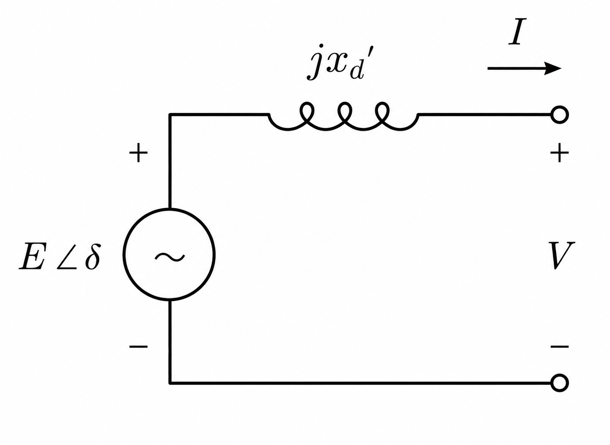
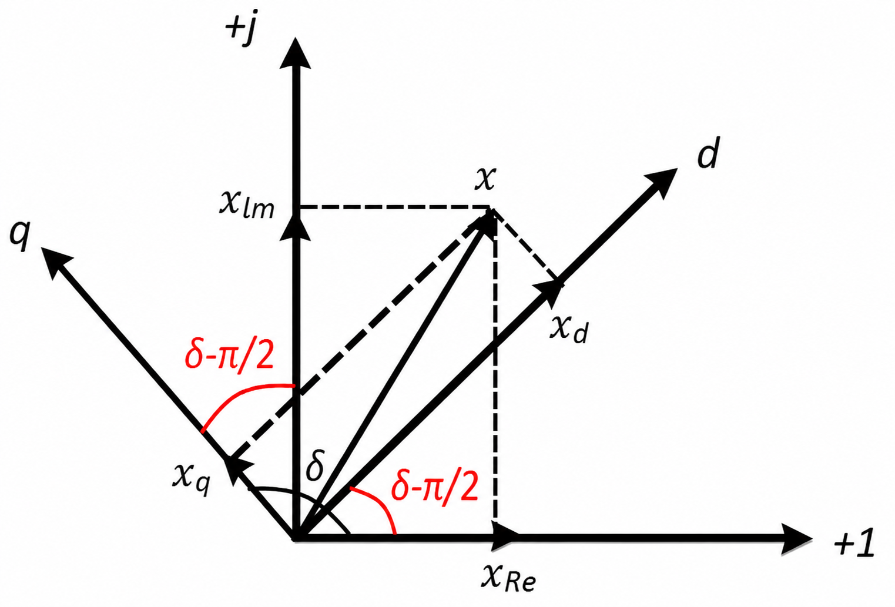

# 3. Generator models

TSCOPF couples dispatch to transient constraints through a **machine model** at each generator bus. Two orders are implemented today:

- **Classical second-order** (`gen_order = CLASSICAL_2ND`) — one internal voltage $E'$ behind transient reactance $x'_d$; states $\delta_g$ and $\Delta\omega_g$. Default on Kron and FULL_BUS.
- **Fourth-order $dq$** (`gen_order = DQ_4TH`) — two-axis transient emfs $E'_d$, $E'_q$ with stator algebraic balance; states $\delta_g$, $\Delta\omega_g$, $E'_{d,g}$, $E'_{q,g}$ plus currents $I_{d,g}$, $I_{q,g}$. **FULL_BUS TSC-ACOPF only.**

Swing discretisation and COI bounds are identical in structure across orders; see [5. Swing dynamics and discretization](05_swing_dynamics.md). Optional AVR and governor layers are in [8. Machine controls](08_controls_avr_governor.md), and grid-forming converters in [9. Grid-forming inverters](09_grid_forming.md).

| Symbol | Meaning |
|---|---|
| $E'$, $x'_d$ | Classical internal voltage and transient reactance (`Xd_tr`) |
| $E'_{d,g}$, $E'_{q,g}$ | $dq$ transient emfs on the $d$ and $q$ axes (`Ed`, `Eq` in code) |
| $I_{d,g}$, $I_{q,g}$ | Stator currents in the rotor $dq$ frame |
| $x'_{d,g}$, $x'_{q,g}$ | Transient reactances (`Xd_tr`, `Xq_tr`) |
| $x_{d,g}$, $x_{q,g}$ | Synchronous reactances (`Xd`, `Xq`) |
| $T'_{d0,g}$, $T'_{q0,g}$ | Open-circuit transient time constants (`Td`, `Tq`) |
| $r_{a,g}$ | Stator resistance (`Ra`) |
| $E_{fd,g}$ | Field voltage (constant, or AVR-driven on `DQ_4TH`) |
| $H_g$, $D_g$ | Inertia [s] and damping |

Select the order with `DynModelConfig.gen_order`. Machine columns live in `gen_dynamic_data.csv` (classical minimum) or `gen_dynamic_data_full.csv` ($dq$ and controls).

---

## Classical second-order model



*The whole of the classical model, electrically. $E\angle\delta$ is the internal emf held constant through the transient (`E` in code, magnitude bounded by `TsBoundLimitsConfig.E_min_pu`/`E_max_pu` when `bound_E = true`), $jx'_d$ is the transient reactance `Xd_tr`, and $V$ is the terminal — the Kron-reduced fictitious node, or the FULL_BUS network bus $k(g)$. There is no stator resistance and no $q$-axis: the machine is one source behind one reactance, and all of its dynamics sit in the rotor equations below.*

The classical model is the standard **single-circuit** representation used in many power-system texts: a constant voltage source $E'_g \angle \delta_g$ behind transient reactance $x'_{d,g}$, with rotor angle $\delta_g$ and per-unit speed deviation $\Delta\omega_g$ as states. Electrical torque enters through active power $P_g^{\mathrm{ele}}$ (Kron reduced sum or classical terminal map on FULL_BUS).

!!! note "Model 3.1 (classical machine, schematic)"
    ```math
    \begin{equation}
    \label{eq:classical-schematic}
    P_g^{\mathrm{ele}} = \frac{E'_g V_{k(g)}}{x'_{d,g}} \sin(\delta_g - \theta_{k(g)}),
    \qquad
    \frac{2H_g}{\omega_s}\frac{d\Delta\omega_g}{dt} = P_{m,g} - P_g^{\mathrm{ele}} - D_g \Delta\omega_g,
    \qquad
    \frac{d\delta_g}{dt} = \omega_s \Delta\omega_g .
    \end{equation}
    ```

    On the Kron path, $P_g^{\mathrm{ele}}$ during the swing is the pairwise admittance sum (Model 6.5 on [page 6](06_tsc_opf_assembled.md)), not the two-bus formula above. The schematic $\eqref{eq:classical-schematic}$ is the steady-state initial link (Models 6.1–6.2).

**Parameters:** `Xd_tr`, `H`, `D` per generator. **Paths:** `KRON_REDUCED` (default) and `FULL_BUS` with `mech_power_mode = USE_PG` or `USE_PM`.

For textbook derivations of the round-rotor classical model, see standard references such as Kundur (*Power System Stability and Control*) or any power-system analysis text on the swing equation.

---

## Fourth-order two-axis model

The fourth-order model (also called a **two-axis** or $dq$ model) keeps separate transient dynamics on the direct and quadrature axes. It is more realistic than Model 3.1 when you need terminal voltage and current to co-evolve with the swing during a fault. TSCOPF follows the usual simplification: **subtransient** dynamics are neglected by assuming damper-winding transients are fast enough to settle (Weckesser et al.; Liederer et al. on TSC formulations).

The machine is represented by transient emfs $E'_{d,g}$, $E'_{q,g}$ behind transient reactances $x'_{q,g}$, $x'_{d,g}$ and stator resistance $r_{a,g}$. The four differential states are $E'_{q,g}$, $E'_{d,g}$, $\Delta\omega_g$, and $\delta_g$. Stator currents $I_{d,g}$, $I_{q,g}$ are additional algebraic (or coupled) variables at each time step on the FULL_BUS path.

Terminal $d$–$q$ voltages are the Park components of bus voltage $V_{k(g)}$, $\theta_{k(g)}$ in the rotor frame: $V_{d} = V_{k(g)}\sin(\delta_g - \theta_{k(g)})$, $V_{q} = V_{k(g)}\cos(\delta_g - \theta_{k(g)})$.



*The frame convention behind those two projections, and the one place where a sign slip is easy. A network phasor $x = x_{\mathrm{Re}} + jx_{\mathrm{Im}}$ is resolved on a rotor frame whose $d$ axis leads the real axis by $\delta - \pi/2$ and whose $q$ axis leads $d$ by a further $\pi/2$ — equivalently, the $q$ axis sits at angle $\delta$. Substituting $x = V_{k}e^{j\theta_k}$ gives exactly $V_d = V_k\sin(\delta - \theta_k)$ and $V_q = V_k\cos(\delta - \theta_k)$: the **sine** goes with $d$ and the **cosine** with $q$, which is the opposite of the convention some references use. The same projection defines $I_{d,g}$, $I_{q,g}$, and the inverse map is what returns machine currents to the nodal balance in `eq_const_dq_Pbalance!` / `eq_const_dq_Qbalance!`. Grid-forming converters ([chapter 9](09_grid_forming.md)) reuse this frame unchanged, which is why a mixed fleet needs no special-casing in the nodal balance.*

### Stator voltage balance

!!! note "Model 3.2 ($dq$ stator algebra)"
    For generator $g$ at terminal bus $k(g)$,

    ```math
    \begin{align}
    V_{d,k}
    &= (1+\Delta\omega_g)\, E'_{d,g}
    - r_{a,g} I_{d,g}
    + x'_{q,g} I_{q,g}
    \label{eq:dq-vd} \\
    V_{q,k}
    &= (1+\Delta\omega_g)\, E'_{q,g}
    - r_{a,g} I_{q,g}
    - x'_{d,g} I_{d,g}
    \label{eq:dq-vq}
    \end{align}
    ```

    Equations $\eqref{eq:dq-vd}$–$\eqref{eq:dq-vq}$ are the stator voltage balance on each axis. Terminal voltage on axis $d$ (or $q$) depends on the internal emf induced by the rotor, the ohmic drop in the stator winding, and inductive coupling from the orthogonal axis current.

    `eq_const_dq_machine_algebra!` stamps these rows each transient step. The factor $1+\Delta\omega_g$ is controlled by `dq_speed_dev_in_algebra` (default `true`, RMS-style); set `false` to drop speed from stator and power equations (common small-signal simplification; Glover, Sarma, Overbye).

### Transient emf dynamics

!!! note "Model 3.3 ($dq$ flux dynamics)"
    ```math
    \begin{align}
    T'_{d0,g}\,\frac{dE'_{q,g}}{dt}
    &= E_{fd,g} - E'_{q,g} - (x_{d,g} - x'_{d,g})\, I_{d,g}
    \label{eq:dq-eq-ode} \\
    T'_{q0,g}\,\frac{dE'_{d,g}}{dt}
    &= -E'_{d,g} + (x_{q,g} - x'_{q,g})\, I_{q,g}
    \label{eq:dq-ed-ode}
    \end{align}
    ```

    $E'_{q,g}$ is tied to the $d$-axis flux equation $\eqref{eq:dq-eq-ode}$ because terminal voltage on the $q$ axis is induced 90° ahead of the flux; $E'_{d,g}$ plays the symmetric role on $\eqref{eq:dq-ed-ode}$. The field voltage $E_{fd,g}$ appears on the $d$ axis because the exciter acts in line with the direct axis.

    The terms $-E'_{q,g}$ and $-E'_{d,g}$ capture flux decay through field and damper resistance. Stator-reaction terms of the form $x-x'$ times axis current oppose abrupt flux changes. $T'_{d0,g}$ and $T'_{q0,g}$ set how fast transient flux decays.

    During the transient, `eq_const_dq_emf_dynamics!` discretises $\eqref{eq:dq-eq-ode}$–$\eqref{eq:dq-ed-ode}$ with the same implicit trapezoidal rule used for the swing on [page 5](05_swing_dynamics.md). With `include_avr = false`, $E_{fd,g}$ is constant at the pre-fault value.

### Rotor motion

The swing pair matches Model 5.1:

!!! note "Model 3.4 (rotor motion, all orders)"
    ```math
    \begin{equation}
    \label{eq:dq-swing}
    \frac{d\delta_g}{dt} = \omega_s \Delta\omega_g,
    \qquad
    \frac{2H_g}{\omega_s}\frac{d\Delta\omega_g}{dt}
    = P_{m,g} - P_{g}^{\mathrm{ele}} - D_g \Delta\omega_g .
    \end{equation}
    ```

    Trapezoidal rows are shared with the classical path (`eq_const_kron_δ_swingeq_generic!`, `eq_const_tsred_Δω_swingeq_generic!` on FULL_BUS builders).

### Electrical torque and power

!!! note "Model 3.5 ($dq$ torque and power)"
    ```math
    \begin{align}
    T^{\mathrm{ele}}_g &= E'_{d,g} I_{d,g} + E'_{q,g} I_{q,g}
    \label{eq:dq-te} \\
    P_{g}^{\mathrm{ele}} &= (1+\Delta\omega_g)\, T^{\mathrm{ele}}_g
    \label{eq:dq-pe} \\
    Q_g &= V_{q,k}\, I_{d,g} - V_{d,k}\, I_{q,g}
    \label{eq:dq-q}
    \end{align}
    ```

    With `dq_speed_dev_in_algebra = false`, $\eqref{eq:dq-pe}$ reduces to $P_{g}^{\mathrm{ele}} = T^{\mathrm{ele}}_g$ and the speed factor is removed from $\eqref{eq:dq-vd}$–$\eqref{eq:dq-vq}$ as well.

    Further simplifications sometimes used in textbooks — $r_{a,g} = 0$ or a round rotor with $x'_{d,g} = x'_{q,g}$ — are parameter choices in the CSV, not separate code paths.

### Coupling to the network

Unlike the classical FULL_BUS map (active power as a function of $E'$, $V$, $\delta$ only), the $dq$ path injects **currents** into nodal KCL:

- Active balance uses $P$-injection from $I_d$, $I_q$, $V$, $\theta$, $\delta$ (`eq_const_dq_Pbalance!`).
- Reactive balance is analogous (`eq_const_dq_Qbalance!`).

Pre-fault, `eq_const_dq_init_steady_state!` pins the machine to the solved ACOPF point — bus voltage, angle, and dispatch $P_g$, $Q_g$. Warm starts use `dq_machine_warmstart` to project complex terminal voltage and current into field voltage, rotor angle, emfs, and $dq$ currents.

!!! info "Assumption"
    `DQ_4TH` requires `network_form = FULL_BUS`, `mech_power_mode = USE_PM`, and `bound_style_δ = :coi_box`. TSC-DCOPF and Kron reduction are **not** implemented for this order.

---

## Parameter files

| Column | Classical | $dq$ (`gen_dynamic_data_full.csv`) |
|---|---|---|
| `Xd_tr` | yes | yes ($x'_d$) |
| `H`, `D` | yes | yes |
| `Xq_tr` | — | yes ($x'_q$) |
| `Xd`, `Xq` | — | yes |
| `Td`, `Tq` | — | yes ($T'_{d0}$, $T'_{q0}$) |
| `Ra` | — | yes ($r_a$) |
| `T_exc`, `K_exc`, `Ta_exc`, `Tb_exc` | — | AVR only (`Ta_exc=Tb_exc=0` bypasses lead-lag) |
| `R`, `T1`–`T3` | — | governor only |

---

## Worked example

!!! tip "Example 3.1 · fourth-order machine on IEEE 9-bus"
    ```julia
    cfg_dq = RunConfig(
        trans_stab = true, case = "9bus", solver_name = "Ipopt",
        dispatch = DispatchConfig(type_model = "ACOPF"),
        transient = TransientConfig(
            simulation = TsSimulationConfig(δ_tol_deg = 90.0),
            dyn_model = DynModelConfig(
                gen_order = DQ_4TH,
                network_form = FULL_BUS,
                mech_power_mode = USE_PM,
                bound_style_δ = :coi_box,
                gen_dynamic_filename = "gen_dynamic_data_full.csv",
                zip_load_p = (1.0, 0.0, 0.0),  # (Z, I, P) — active demand, constant impedance
                zip_load_q = (1.0, 0.0, 0.0),  # (Z, I, P) — reactive demand, constant impedance
                fault = FaultConfig(contingency_id = 2),
            ),
        ),
    )
    ```

    Compare trajectories in `Transient_Stability/CSV/generator_*.csv` (including `Ed`, `Eq`, `Id`, `Iq`) against the classical Kron preset in Example 5.1 on [page 5](05_swing_dynamics.md). Expect different $P_g^{\mathrm{ele}}$ paths during the fault because reactive balance and axis flux dynamics are explicit.

---

## Where this lives in the code

| Piece | Function | File |
|---|---|---|
| Classical Kron / FULL_BUS builders | `Make_Dynamic_Model_tsred!`, `Make_Dynamic_Model_fullbus!` | `functions_2_build_TS_model_w_Kron.jl`, `functions_2_build_TS_model_w_FullBus.jl` |
| $dq$ FULL_BUS builder | `Make_Dynamic_Model_dqfullbus!` | `functions_2_build_TS_model_w_DqFullBus.jl` |
| Pre-fault $dq$ steady state | `eq_const_dq_init_steady_state!` | `functions_4_TS_dq_eqconst.jl` |
| $\eqref{eq:dq-vd}$–$\eqref{eq:dq-pe}$ | `eq_const_dq_machine_algebra!` | `functions_4_TS_dq_eqconst.jl` |
| $\eqref{eq:dq-eq-ode}$–$\eqref{eq:dq-ed-ode}$ (trapezoidal) | `eq_const_dq_emf_dynamics!` | `functions_4_TS_dq_eqconst.jl` |
| Nodal injection | `eq_const_dq_Pbalance!`, `eq_const_dq_Qbalance!` | `functions_4_TS_dq_eqconst.jl` |
| ACOPF → $dq$ warm start | `dq_machine_warmstart` | `functions_4_TS_dq_helpers.jl` |
| Order selection | `DynModelConfig.gen_order` | `DynModelConfig.jl` |
| Grid-forming (GFM) attachers | `Attach_GFM_init!` / `_fault!` / `_postf!` | `functions_4_TS_gfm.jl` |

---

## Beyond the machine core

Two extensions sit outside this chapter because they change what a "generator" is rather than how a machine is modelled:

- **Control loops** — an AVR that moves $E_{fd,g}$ and a TGOV1 governor that turns the constant $P_{m,g}$ into a trajectory. Both wrap around the machine models above without altering them. See [8. Machine controls: AVR and turbine governor](08_controls_avr_governor.md).
- **Grid-forming converters** — units with no rotor at all, whose frequency follows an algebraic droop law rather than a swing equation, sharing the same $dq$ interface and the same nodal balance as the machines here. See [9. Grid-forming inverters](09_grid_forming.md).

The assembled TSC-OPF with classical machines is on [6. The TSC-OPF, assembled](06_tsc_opf_assembled.md).
