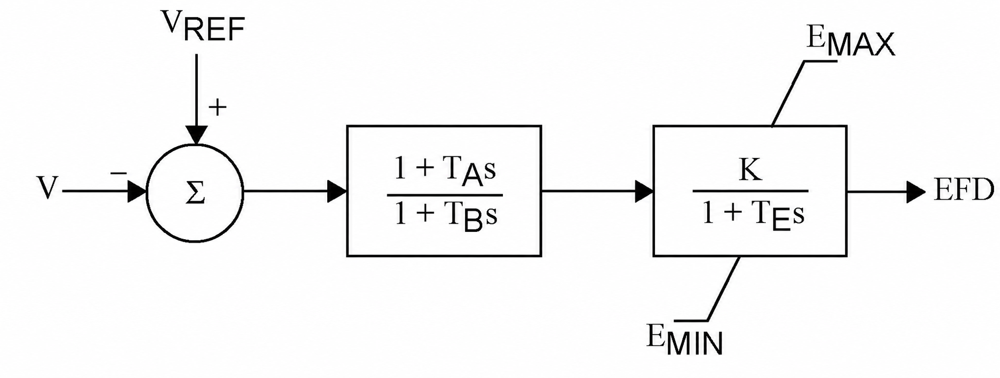
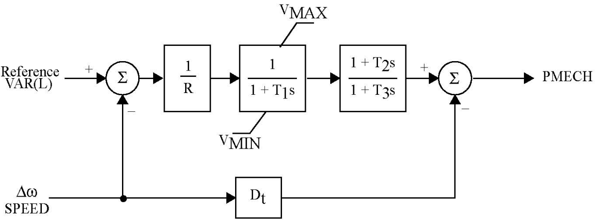

# 8. Machine controls: AVR and turbine governor

Chapters 3–6 treat the field voltage $E_{fd,g}$ and the mechanical power $P_{m,g}$ as constants held at their pre-fault values. That is the standard first-swing assumption, and it is what TSCOPF does by default. Two optional control layers relax it:

- **AVR** (`DynModelConfig.include_avr = true`) — a first-order exciter that moves $E_{fd,g}$ in response to terminal-voltage error. Requires `gen_order = DQ_4TH`, because the classical model has no field-voltage input to act on.
- **TGOV1 governor** (`DynModelConfig.include_governor = true`) — valve plus turbine lag that replaces the constant $P_{m,g}$ with a trajectory $P_{m,g}^t$ driven by speed deviation. Available on `FULL_BUS`, classical **and** `DQ_4TH`, and requires `mech_power_mode = USE_PM`.

Both layers add states per generator per time step, so they roughly double the transient block of the NLP. Both also add their own dual families, which is the point for the economic analysis in [7. Duals, KKT, and the economics](07_duals_economics.md): with controls active, the shadow price of a stability corridor is partly a price on *control effort*, not only on dispatch.

| Symbol | Meaning | Source |
|---|---|---|
| $E_{fd,g}$ | Saturated field voltage entering the $E'_q$ emf ODE | state |
| $\tilde{E}_{fd,g}$ | Pre-saturation exciter state (`E_fd_unlim` in code) | state |
| $V_{\mathrm{ref},g}$ | Exciter voltage set-point, constant over the run | variable |
| $K_{\mathrm{exc},g}$, $T_{\mathrm{exc},g}$ | Exciter gain and time constant | `K_exc`, `T_exc` |
| $P_{v,g}$ | Valve (gate) position, in power units | state |
| $\tilde{P}_{v,g}$ | Pre-saturation valve state (`Pv_raw` in code) | state |
| $P_{\mathrm{ref},g}$ | Governor set-point, **$R$-scaled** — see Model 8.6 | variable |
| $R_g$ | Droop | `R` |
| $T_{1,g}, T_{2,g}, T_{3,g}$ | Valve lag, turbine lead, turbine lag | `T1`, `T2`, `T3` |
| $\Delta\omega_g$ | Per-unit speed deviation | state |

Control parameters live in the SG machine file, which must be the extended one — `TransientConfig.gen_dynamic_filename = "gen_dynamic_data_full.csv"`. `required_dyn_column_names` adds `T_exc, K_exc` when `include_avr` is on and `R, T1, T2, T3` when `include_governor` is on; a missing column fails before any model is built.

---

## AVR (automatic voltage regulator)



*Reference AVR block. **TSCOPF implements the right-hand block only.** There is no lead-lag stage — the code path is equivalent to $T_A = T_B$, so the transfer function collapses to $K/(1+T_E s)$, mapping to $K_{\mathrm{exc}}/(1+T_{\mathrm{exc}} s)$ with both parameters read per generator from `gen_dynamic_data_full.csv`. The summing junction is exactly the code's $V_{\mathrm{ref}} - V$ with $V$ the generator-bus voltage magnitude, and $E_{\mathrm{MIN}}/E_{\mathrm{MAX}}$ are **not** CSV columns: they come from `TsBoundLimitsConfig.E_min_pu` / `E_max_pu` (see the note on that overload below).*

### The exciter as implemented

!!! note "Model 8.1 (first-order exciter)"
    ```math
    \begin{equation}
    \label{eq:avr-ode-8}
    T_{\mathrm{exc},g}\,\frac{d\tilde{E}_{fd,g}}{dt}
      = K_{\mathrm{exc},g}\bigl(V_{\mathrm{ref},g} - V_{k(g)}\bigr) - \tilde{E}_{fd,g} ,
    \qquad
    E_{fd,g} = \mathrm{sat}\bigl(\tilde{E}_{fd,g}\bigr) .
    \end{equation}
    ```

    $V_{k(g)}$ is the voltage magnitude at the generator's bus, taken per time step from `V_tf` / `V_tpf` on the FULL_BUS network. The saturated output $E_{fd,g}$, not the raw state, is what enters the $E'_q$ dynamics of Model 3.4.

!!! note "It is a lag, not an integrator"
    The $-\tilde{E}_{fd,g}$ self-decay term is easy to lose sight of, and dropping it turns the block into a pure integrator with very different transient behaviour. To confirm it is there, expand the trapezoidal rows below and divide by $\Delta t$: $\eqref{eq:avr-ode-8}$ comes back with the decay term intact. That is what makes $K/(1+T_E s)$ in the figure the right reading, and what makes the pre-fault link of Model 8.2 the steady state of the same equation rather than an independent assumption.

At the pre-fault operating point $d\tilde{E}_{fd}/dt = 0$, so $\eqref{eq:avr-ode-8}$ collapses to the steady-state gain that pins the initial field voltage:

!!! note "Model 8.2 (pre-fault exciter link)"
    ```math
    \begin{equation}
    \label{eq:avr-init-8}
    E_{fd,g} - K_{\mathrm{exc},g}\bigl(V_{\mathrm{ref},g} - V_{k(g)}\bigr) = 0 .
    \end{equation}
    ```

    Built by `eq_const_avr_Efd_init!` for every active SG. This is what makes $V_{\mathrm{ref},g}$ an *optimisation variable* rather than an input: the OPF chooses the exciter set-point consistent with the dispatched voltage profile and the field voltage the machine needs. Its dual is exported as `dual_Vref_init.csv`.

The consequence is worth stating plainly for the economics: with `include_avr = true`, $V_{\mathrm{ref}}$ joins the decision vector, so the solver can buy transient headroom by shifting a machine's excitation set-point. Without the AVR, $E_{fd}$ is frozen and that degree of freedom does not exist.

### Discretisation

The window ODEs are trapezoidal. With $c = \Delta t / (2 T_{\mathrm{exc},g})$, the row assembled at step $t$ is

!!! note "Model 8.3 (trapezoidal exciter step)"
    ```math
    \begin{equation}
    \label{eq:avr-trap-8}
    \tilde{E}_{fd,g}^{\,t}(1+c)
      - E_{fd,g}^{\,t-1}(1-c)
      - K_{\mathrm{exc},g}\,c\left(2V_{\mathrm{ref},g} - V_{k(g)}^{t} - V_{k(g)}^{t-1}\right) = 0 .
    \end{equation}
    ```

    Two details that are easy to miss. First, the previous-step anchor is the **saturated** $E_{fd}^{t-1}$, not the raw state $\tilde{E}_{fd}^{\,t-1}$ — this is the anti-windup behaviour: once the clamp is active, the integrator is fed back its limited output rather than its own unlimited history. Second, $t=1$ of each window anchors across the window boundary: the fault window uses the pre-fault scalar pair $(E_{fd,g}, V_{k(g)})$, the post-fault window uses the last fault-on pair.

    The row is normalised on the state, not on $K_{\mathrm{exc},g}$: the gain multiplies the voltage-error term instead of dividing the two field-voltage terms. Both forms describe the same ODE — they differ by the constant factor $K_{\mathrm{exc},g}$ on the whole row — but this one keeps the $(1+c)$ coefficient on $\tilde{E}_{fd}$ that every other state ODE in the package uses, and matches the backward-Euler row below.

    Scaling an equality row leaves the feasible set untouched, so nothing primal moves: same trajectories, same dispatch, same objective. The multiplier is what changes, and it changes *inversely* — $\lambda_{\text{new}} = \lambda_{\text{old}}/K_{\mathrm{exc},g}$, since $\lambda h$ must contribute the same term to the Lagrangian when $h$ is multiplied through. Three things follow. Exciter duals recorded before this convention must be divided by that machine's gain before they are comparable with new ones. Under the old form each row was divided by its *own* $K_{\mathrm{exc},g}$, so `dual_avr_E_fd` was not comparable across a fleet with heterogeneous gains, nor against the swing and EMF duals; now every dynamic row carries the same $(1+c)$ normalisation and all of them are. And `constr_viol_tol` now bites in field-voltage units: with $K_{\mathrm{exc}} = 200$ the old row let a residual of $2\times10^{-6}$ p.u. in $E_{fd}$ pass a $10^{-8}$ tolerance.

    None of this is about conditioning. Ipopt's default `nlp_scaling_method = gradient-based` rescales rows internally, which is exactly why the trajectories did not move; the argument for this form is dual interpretability, not solver behaviour. It would start to matter numerically only under `nlp_scaling_method = "none"`.

Setting `DynModelConfig.ode_first_step = :backward_euler` replaces the $t=1$ row of each window with the backward-Euler form $\tilde{E}_{fd}^{\,1}(1 + \Delta t/T_{\mathrm{exc}}) - E_{fd}^{\,0} = (\Delta t/T_{\mathrm{exc}})K_{\mathrm{exc}}(V_{\mathrm{ref}} - V^1)$, which matches the reference implementation. Every subsequent step stays trapezoidal under either setting. The switch exists for parity investigation; `:trapezoidal` is the package default and the pinned SG behaviour.

### Field-voltage saturation

The clamp is a smooth sqrt approximation of $\min/\max$, applied as an **equality** linking two variables, not as a bound:

!!! note "Model 8.4 (smooth field-voltage clamp)"
    ```math
    \begin{equation}
    \label{eq:avr-sat-8}
    a = \frac{\tilde{E}_{fd} + E^{\max} - \sqrt{(\tilde{E}_{fd} - E^{\max})^2 + \rho}}{2},
    \qquad
    E_{fd} = \frac{a + E^{\min} + \sqrt{(a - E^{\min})^2 + \rho}}{2},
    \end{equation}
    ```

    with $\rho = 10^{-4}$ (`_AVR_SMOOTH_RHO`). As $\rho \to 0$ this is exactly $\max(\min(\tilde{E}_{fd}, E^{\max}), E^{\min})$; the finite $\rho$ keeps the gradient defined at the corners, at the cost of a small bias — at the limit itself the smoothed value sits $\sqrt{\rho}/2 = 0.005$ p.u. inside the clamp. The relation is nonconvex, which is why the AVR path is Ipopt/MadNLP only.

    Because it is an equality on its own variable pair, the clamp carries a multiplier of its own (`dual_avr_E_fd_sat.csv`). That multiplier is the economically interesting one: it is nonzero exactly when the exciter is saturated, i.e. when the machine cannot supply the excitation the stability corridor wants.

!!! warning "`E_min_pu` / `E_max_pu` are overloaded"
    The clamp limits come from `resolve_ts_bound_limits`'s `:E` spec — the same `TsBoundLimitsConfig.E_min_pu` / `E_max_pu` pair that bounds the *classical internal emf* $E'$ when `TsBuilderConfig.bound_E = true`. On the DQ+AVR path those numbers are a **field-voltage** ceiling and floor, and the default $[0, 2]$ p.u. is tight for that role. Runs pinned against the reference implementation set `E_max_pu = 4.0`. Changing this field changes the emf box and the exciter clamp together; there is no separate knob today.

### Comparing the saturated and unsaturated field voltage

Both trajectories are exported (`dq_E_fd_pu.csv`, `dq_E_fd_unlim_pu.csv`). The gap between them at a given step *is* the active clamp. A run where the two curves coincide throughout has an AVR that never saturated, and its `dual_avr_E_fd_sat` column will be numerically negligible — a useful sanity check before reading anything economic into the exciter duals.

---

## TGOV1 turbine governor



*Reference TGOV1 block. **TSCOPF implements the forward path only.** The $D_t\,\Delta\omega$ damping branch that subtracts from $P_{\mathrm{MECH}}$ at the output summing junction is not implemented — there is no `Dt` column in `gen_dynamic_data_full.csv`, and mechanical damping enters instead through the swing equation's $D_g \Delta\omega_g$ term (Model 5.2). $V_{\mathrm{MIN}}/V_{\mathrm{MAX}}$ on the valve map to `TsBoundLimitsConfig.gov_valve_min_pu` and `gov_valve_max_source`, and bind only when `governor_limiter ≠ GOV_NO_LIMIT`. The `Reference VAR(L)` input is $P_{\mathrm{ref},g}$, which here is $R$-scaled (Model 8.6).*

### Transfer function and the state form the code uses

TGOV1 in transfer-function form is a droop gain, a valve lag, and a turbine lead-lag:

```math
P_v = \frac{1}{1 + T_1 s}\cdot\frac{P_{\mathrm{ref}} - \Delta\omega}{R},
\qquad
P_m = \frac{1 + T_2 s}{1 + T_3 s}\, P_v .
```

The builder stamps the valve lag as a first-order ODE and the turbine lead-lag exactly as written, derivative of the input included:

!!! note "Model 8.5 (governor state equations)"
    ```math
    \begin{align}
    \label{eq:gov-valve-8}
    T_{1,g}\,\frac{d\tilde{P}_{v,g}}{dt}
      &= \frac{P_{\mathrm{ref},g} - \Delta\omega_g}{R_g} - \tilde{P}_{v,g} , \\[4pt]
    \label{eq:gov-mech-8}
    T_{3,g}\,\frac{dP_{m,g}}{dt} + P_{m,g}
      &= T_{2,g}\,\frac{dP_{v,g}}{dt} + P_{v,g} .
    \end{align}
    ```

    $\eqref{eq:gov-mech-8}$ consumes the **limited** valve output $P_{v,g}$ and nothing else — no $P_{\mathrm{ref}}$, no $\Delta\omega$, no $R_g$ or $T_{1,g}$ — while $\eqref{eq:gov-valve-8}$ integrates the **raw** state $\tilde{P}_{v,g}$. Under `GOV_NO_LIMIT` and `GOV_HARD_BOUND` the two coincide; under `GOV_SMOOTH` they differ by the clamp, and the turbine sees only the clamped signal.

    The valve integrator is **anti-windup**, exactly as the exciter is: the discrete form of $\eqref{eq:gov-valve-8}$ advances $\tilde{P}_{v,g}^{t}$ from the *limited* $P_{v,g}^{t-1}$, not from $\tilde{P}_{v,g}^{t-1}$. Integrating the raw state against itself makes it a free integrator — under `GOV_SMOOTH` it keeps climbing for as long as the droop signal demands while the output sits pinned at the clamp, and the machine cannot come off the limit until that accumulated excess has been unwound. With the clamped value fed back, $\tilde{P}_{v,g}$ can overshoot the limit by at most one step's valve travel. Where $P_{v,g} \equiv \tilde{P}_{v,g}$ the distinction is vacuous, so `GOV_NO_LIMIT` and `GOV_HARD_BOUND` stamp the same rows either way.

!!! warning "Why not the substituted state form"
    Eliminating $\dot{P}_v$ with $\eqref{eq:gov-valve-8}$ turns $\eqref{eq:gov-mech-8}$ into the familiar two-state form
    $T_3\dot{P}_m = (1 - T_2/T_1)P_v + \bigl[(T_2/T_1)/R\bigr](P_{\mathrm{ref}} - \Delta\omega) - P_m$,
    which the code used until it was found to be wrong under saturation. That substitution is exact only while the valve is unsaturated: once a limiter clamps $P_v$, $\dot{P}_v \neq \bigl[(P_{\mathrm{ref}}-\Delta\omega)/R - P_v\bigr]/T_1$, yet the feedforward term keeps injecting the raw, unclamped droop signal into the mechanical power — the limiter is bypassed and valve saturation never caps $P_m$ when $T_2 > 0$. Substituting the *discrete* valve equality into the *discrete* substituted mech row recovers $\eqref{eq:gov-mech-8}$ row-for-row, trapezoidal and backward Euler alike, so the two forms are identical whenever the valve is free and differ only where the old one was unphysical.

Discretisation follows the same pattern as the exciter: trapezoidal, $c = \Delta t/(2T_1)$ for the valve and $c = \Delta t/(2T_3)$ for the turbine, with $\eqref{eq:gov-mech-8}$ integrated on both sides and then divided through by $2T_{3,g}$ so the row keeps the same $(1+c)$ normalisation — its multiplier therefore stays on the scale it had under the old form. $t=1$ of the fault window is anchored at $(\tilde{P}_v, P_v, P_m, \Delta\omega) = (P_{m,g}, P_{m,g}, P_{m,g}, 0)$ and $t=1$ of the post-fault window at the last fault-on values, valve **and** turbine both taking the **limited** $P_{v,g}$ there — anything else would put a one-step discontinuity in the valve recurrence at the window seam; the same `ode_first_step` override applies to the first row of each window.

### Initialisation and the $R$-scaled set-point

!!! note "Model 8.6 (governor set-point)"
    ```math
    \begin{equation}
    \label{eq:gov-init-8}
    P_{\mathrm{ref},g} - R_g\,P_{m,g} = 0 .
    \end{equation}
    ```

    At the pre-fault equilibrium $\Delta\omega_g = 0$ and every derivative vanishes, so $\eqref{eq:gov-valve-8}$ gives $\tilde{P}_{v,g} = P_{\mathrm{ref},g}/R_g$ and $\eqref{eq:gov-mech-8}$ gives $P_{m,g} = P_{v,g}$. Both reduce to $\tilde{P}_{v,g} = P_{v,g} = P_{m,g}$ when $P_{\mathrm{ref},g} = R_g P_{m,g}$, which is what `eq_const_gov_setpoint_init!` pins. Dual: `dual_Pref_init.csv`.

    **$P_{\mathrm{ref},g}$ is therefore not a power.** It carries the droop factor, so a machine with $R = 0.05$ dispatched at $P_m = 0.8$ p.u. has $P_{\mathrm{ref}} = 0.04$. If you compare `governor_P_ref.csv` against a reference implementation that defines the set-point directly in power units, expect the factor $R$. The `P_ref_source = :dgen_pg_limits` bound on `V_ref`/`P_ref` boxes is expressed in power units, so `TsBuilderConfig.bound_P_ref = true` combined with a small $R$ effectively never binds.

`Attach_Governor_fault!` also carries a safety net: if the path did not already stamp `eq_const_Pm_init`, it adds the $P_m = P_g$ pin itself. Without that pin the governor states are shift-invariant — add a constant to $P_{\mathrm{ref}}$, $P_v$, $P_m$ and every governor equation is still satisfied — and $P_m$ drifts to a level decoupled from the dispatch. Under `mech_power_mode = USE_PM` the classical and DQ builders always stamp it, so the fallback should never fire.

### The three valve limiters

`DynModelConfig.governor_limiter` selects how the valve saturation is represented. The choice is a genuine trade-off between physics and dual quality, which is why it is a user knob rather than a fixed decision.

| Mode | Valve treatment | Duals produced | When to use |
|---|---|---|---|
| `GOV_NO_LIMIT` (default) | $P_v = \tilde{P}_v$, unbounded | valve/mech ODE duals only | Cleanest KKT system; the governor stays linear, so the transient block adds no new nonconvexity. Use when the disturbance is small enough that the valve would not saturate anyway |
| `GOV_SMOOTH` | Smooth sqrt clamp as in $\eqref{eq:avr-sat-8}$, with $\rho = 10^{-4}$ (`_GOV_SMOOTH_RHO`) | adds `dual_gov_valve_sat.csv` | Physically saturating and always feasible. Nonconvex. Matches the reference implementation. This is the setting used in the GFM parity runs |
| `GOV_HARD_BOUND` | Explicit $\le$-form rows $P^{\min} - \tilde{P}_v \le 0$, $\tilde{P}_v - P^{\max} \le 0$ | adds `dual_LB_gov_valve.csv`, `dual_UB_gov_valve.csv` | Clean bound multipliers with an unambiguous complementarity reading. **Can render a strong transient infeasible**: the ODE row and the bound row must hold simultaneously, so a swing that demands more valve travel than $P^{\max}$ allows has no solution rather than a saturated one |

Limits come from `resolve_ts_bound_limits`'s `:gov_valve` spec: the lower side is the scalar `gov_valve_min_pu`, the upper side is per generator, `DGEN.pg_max[g] / base_MVA`, when `gov_valve_max_source = :dgen_pg_limits` (the only accepted value today).

---

## Configuration and validation

```julia
DynModelConfig(
    gen_order        = DQ_4TH,      # AVR requires this; governor does not
    network_form     = FULL_BUS,
    mech_power_mode  = USE_PM,      # governor writes P_m; USE_PG has nothing to write to
    bound_style      = :coi_box,
    include_avr      = true,
    include_governor = true,
    governor_limiter = GOV_SMOOTH,
    ode_first_step   = :trapezoidal,
)
```

`validate_dyn_config!` (`engine.jl`) rejects the incoherent combinations before any variable is created:

| Combination | Error |
|---|---|
| `include_avr = true` with `gen_order ≠ DQ_4TH` | `include_avr=true requires gen_order=DQ_4TH.` |
| `include_governor = true` with `mech_power_mode = USE_PG` | `include_governor=true requires mech_power_mode=USE_PM (governor acts on P_m / P_mech).` |
| `include_governor = true` with `network_form = KRON_REDUCED` | `include_governor=true is currently supported only on network_form=FULL_BUS …` |
| `ode_first_step` outside `(:trapezoidal, :backward_euler)` | `ode_first_step must be :trapezoidal or :backward_euler …` |

The governor restriction to FULL_BUS is a wiring limitation rather than a physical one — the governor layer itself is network-agnostic, it only needs $\Delta\omega_g$ — but the Kron path does not run the coupling initialisation that supplies the warm-started $P_m$ anchor.

Output files, figures, and the full dual-export inventory for both layers are catalogued in the user guide, [Dynamic controls (AVR / governor)](../dynamic_controls_avr_governor.md).

---

## Where this lives in the code

| Piece | Function | File |
|---|---|---|
| $\eqref{eq:avr-init-8}$ | `eq_const_avr_Efd_init!` | `functions_4_TS_avr.jl` |
| $\eqref{eq:avr-trap-8}$ | `eq_const_avr_exciter!` | `functions_4_TS_avr.jl` |
| $\eqref{eq:avr-sat-8}$ | `apply_avr_field_limit_smooth!` | `functions_4_TS_avr.jl` |
| AVR window assembly | `Attach_Avr_init!`, `Attach_Avr_fault!`, `Attach_Avr_postfault!` | `functions_4_TS_avr.jl` |
| $\eqref{eq:gov-valve-8}$ | `eq_const_gov_valve!` | `functions_4_TS_governor.jl` |
| $\eqref{eq:gov-mech-8}$ | `eq_const_gov_mech!` | `functions_4_TS_governor.jl` |
| $\eqref{eq:gov-init-8}$ | `eq_const_gov_setpoint_init!` | `functions_4_TS_governor.jl` |
| Limiter dispatch | `apply_gov_valve_limit!` and the three `apply_gov_valve_limit_*!` | `functions_4_TS_governor.jl` |
| Governor window assembly | `Attach_Governor_fault!`, `Attach_Governor_postf!` | `functions_4_TS_governor.jl` |
| Clamp / valve limit resolution | `resolve_ts_bound_limits`, `attach_gov_prefault_bounds!` | `ts_bound_limits.jl` |
| Required CSV columns | `required_dyn_column_names` | `DynModelConfig.jl` |

Grid-forming inverters, which replace the swing equation entirely rather than adding a loop around it, are on [9. Grid-forming inverters](09_grid_forming.md).
