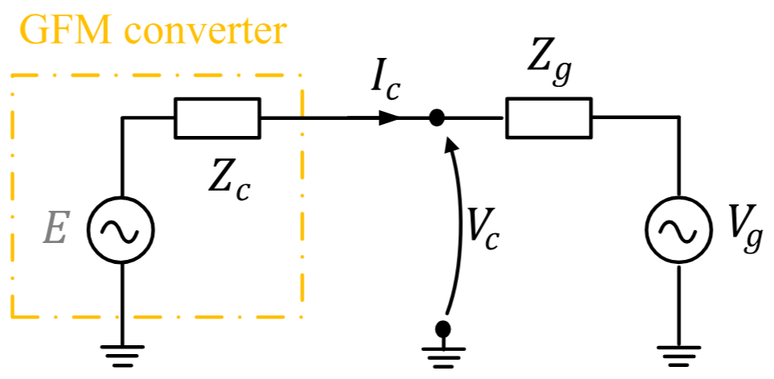
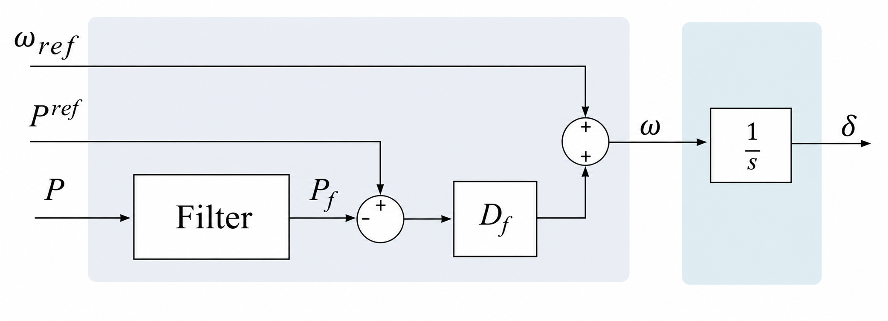
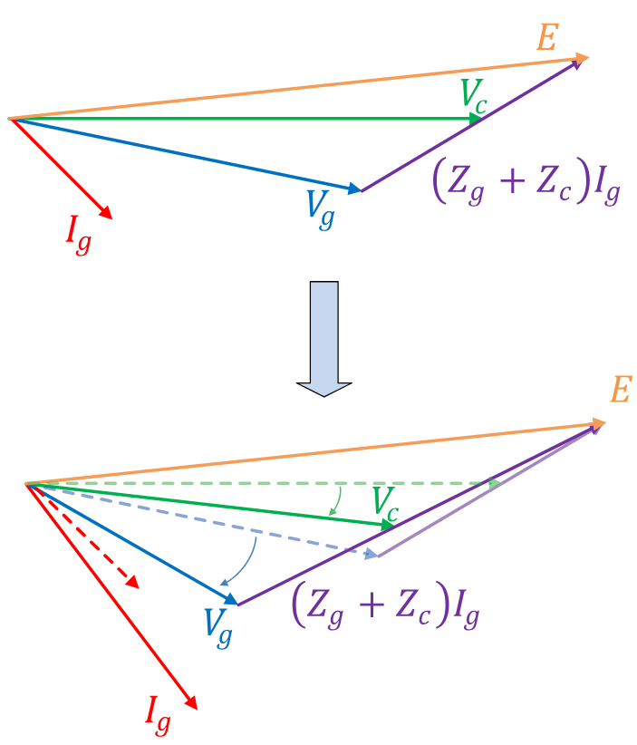

# 9. Grid-forming inverters

A grid-forming (GFM) converter holds a voltage phasor behind a coupling reactance and sets its own frequency from a droop law. That makes it *look* like a synchronous machine to the network — same nodal current injection, same $dq$ interface — while its internal dynamics have nothing in common with a swing equation. There is no rotor, no $H$, no $2H\dot{\Delta\omega} = P_m - P_e$. Frequency is an **algebraic** function of measured power.

TSCOPF supports a mixed fleet: some units are synchronous machines with the 4th-order model of chapter 3, some are GFM converters with the model below, and they share one nodal network and one optimisation problem.

```julia
DynModelConfig(
    gen_order    = DQ_4TH,     # required
    network_form = FULL_BUS,   # required
    allow_gfm    = true,
)
```

`validate_dyn_config!` rejects `allow_gfm` outside `DQ_4TH` + `FULL_BUS`, and rejects it under TSC-DCOPF. A further runtime check in `resolve_sg_gfm_gens!` throws `DQ FULL_BUS requires at least one active SG (all-GFM fleets unsupported)` — the COI reference needs at least one machine with inertia, so a 100 % converter fleet is not representable today.

| Symbol | Meaning | Column |
|---|---|---|
| $X_{\ell,c}$ | Coupling (filter) reactance behind the terminal | `Xl` |
| $m_{p,c}$ | Active-power / frequency droop | `mp` |
| $m_{q,c}$ | Reactive-power / voltage droop | `mq` |
| $K_{pv,c}$, $K_{iv,c}$ | Q–V PI gains | `Kpv`, `Kiv` |
| $T_{f,c}$ | Measurement-filter time constant | `Tf` |
| $E^{\min}_c$, $E^{\max}_c$ | Internal-voltage clip | `Emin`, `Emax` |
| $I^{\max}_c$ | Current-limiter threshold | `Imax` |
| $P^{\min}_c$, $P^{\max}_c$ | Active-power set-point box | `Pmin`, `Pmax` |
| $E_{\mathrm{int},c}$ | PI integrator state (clipped) | state |
| $E_{\mathrm{droop},c}$ | PI output = internal voltage magnitude (clipped) | state |
| $P^{\mathrm{meas}}_c, Q^{\mathrm{meas}}_c, V^{\mathrm{meas}}_c$ | Filtered measurements | states |

---

## Fleet membership

GFM units are **not** flagged inside the SG file. They live in a separate CSV named by `TransientConfig.gfm_dynamic_filename` (default `gfm_dynamic_data.csv`), read into `SystemData.DGFM`, and membership is decided by an `id` partition: a generator id appearing in `DGFM` is a converter, everything else in `active_gen` is a synchronous machine (`sg_active_gens` / `gfm_active_gens`). The two sets are recomputed per disturbance window by `resolve_sg_gfm_gens!` and cached in `dyn_model_dict[:meta][:sg_gens]` / `[:gfm_gens]`.

The practical consequence for anyone post-processing results: **any loop keyed on machine inertia `H` must skip GFM ids**, because those rows simply do not exist in `DGEN_DYN`. Membership is available from `dyn_model_dict[:meta][:gfm_ids]`.

### Per-unit bases

`gfm_dynamic_data.csv` is written on each converter's **own** MVA base, given by the `InvBase` column (accepted aliases `mach_base_MVA`, `inv_base`; a zero entry falls back to the system base). `apply_gfm_base_conversion!` rescales the whole table to system base at read time, with $\beta_c = S^{\mathrm{sys}}_{\mathrm{base}} / S^{\mathrm{mach}}_{\mathrm{base},c}$:

```math
X_\ell \leftarrow \beta X_\ell, \quad
m_q \leftarrow \beta m_q, \quad
m_p \leftarrow \beta m_p, \quad
P^{\max} \leftarrow P^{\max}/\beta, \quad
P^{\min} \leftarrow P^{\min}/\beta, \quad
I^{\max} \leftarrow I^{\max}/\beta .
```

Impedances and droop gains scale up with $\beta$, power and current ratings scale down — the usual direction. Everything downstream of the reader, including every equation on this page, is already on system base. In the bundled `9bus_gfm` case `InvBase = 100` equals the system base, so $\beta = 1$ and the conversion is a no-op; it matters as soon as converters of different sizes are mixed.

!!! warning "`Kppmax` / `Kipmax` are read but unused"
    The parser accepts these two columns and stores them on `DGFM`, but no builder reads them. They are placeholders for an active-power limiter that is not implemented. Setting them has no effect on any result.

---

## Circuit interface



*The converter is modelled as an internal source $E$ behind a purely inductive coupling $Z_c = jX_{\ell,c}$ (`Xl`), delivering $I_c$ into the network bus voltage $V_c$. TSCOPF has no separate $Z_g$: the network side is the full nodal $Y_{\mathrm{bus}}$, and $V_c$ is the FULL_BUS bus-voltage variable that the converter shares with every other element at that bus. There is no resistance in the coupling — unlike the SG stator, which carries `Ra`.*

The converter's internal phasor is placed on the $q$ axis of its own rotating frame, so in the $dq$ variables shared with the synchronous machines $E_{d,c} = 0$ and $E_{q,c} = E_{\mathrm{int},c}$. With the terminal projections $V_{d} = V_{k}\sin(\delta_c - \theta_k)$ and $V_{q} = V_{k}\cos(\delta_c - \theta_k)$ (same convention as chapter 3, figure `parktransformx`), the coupling gives:

!!! note "Model 9.1 (GFM coupling and injection)"
    ```math
    \begin{align}
    \label{eq:gfm-coupling-9}
    V_{d,c} - E_{d,c} - X_{\ell,c} I_{q,c} &= 0 , &
    V_{q,c} - E_{q,c} + X_{\ell,c} I_{d,c} &= 0 , \\[4pt]
    \label{eq:gfm-injection-9}
    P_{e,c} &= V_{d,c} I_{d,c} + V_{q,c} I_{q,c} , &
    Q_{e,c} &= V_{q,c} I_{d,c} - V_{d,c} I_{q,c} .
    \end{align}
    ```

    $\eqref{eq:gfm-injection-9}$ is the *same* terminal map used for synchronous machines, which is exactly why a mixed fleet needs no special-casing in the KCL: `Id`/`Iq` from a converter and from a machine enter the nodal balance identically. The pre-fault forms are stamped by `Attach_GFM_init!` into the same `eq_const_Ed_init` / `eq_const_Vd_init` / `eq_const_P_init` families as the SG rows, keyed by generator id.

Solving $\eqref{eq:gfm-coupling-9}$ for the currents gives $X_\ell I_d = E_q - V_q$ and $X_\ell I_q = V_d$, which is the pair the current limiter below scales.

## Warm start

`gfm_machine_warmstart` maps the ACOPF solution at the converter bus to an initial internal phasor by the textbook construction $V_{\mathrm{int}} = V_c + jX_\ell I_c$ with $I_c = (P_g - jQ_g)/\bar{V_c}$, then reads off $\delta_c = \angle V_{\mathrm{int}}$, $E_c = |V_{\mathrm{int}}|$, and projects the current onto the resulting frame. As with every FULL_BUS path this only sets `start=` values; the equalities above are what actually pin the operating point.

---

## Frequency: droop, not inertia



*Droop block. The measurement filter is the first-order lag on $P$ (`Tf`); $D_f$ is the droop gain `mp`; $\omega_{\mathrm{ref}}$ is synchronous speed, so the block's output $\omega$ becomes the deviation $\Delta\omega_c$ in TSCOPF's variables; and the $1/s$ integrator is the angle update. Note what the diagram makes visible: the path from power error to frequency contains **no** integrator — frequency responds algebraically. All of the converter's "inertia" is the filter lag $T_f$.*

!!! note "Model 9.2 (measurement filters)"
    Both discretisations of $T_{f,c}\,\dot{x} = u - x$ are available, selected per step by
    `gfm_integrator` (see below):

    ```math
    \begin{align}
    \label{eq:gfm-filter-9}
    x^t_c &= \frac{T_{f,c}}{T_{f,c} + \Delta t}\,x^{t-1}_c + \frac{\Delta t}{T_{f,c} + \Delta t}\,u^t_c
      &&\text{(backward Euler)} , \\[4pt]
    \label{eq:gfm-filter-trap-9}
    x^t_c\,(1 + c) &- x^{t-1}_c\,(1 - c) - c\left(u^t_c + u^{t-1}_c\right) = 0 ,
      \quad c = \frac{\Delta t}{2\,T_{f,c}}
      &&\text{(trapezoidal)} ,
    \end{align}
    ```

    with $x \in \{P^{\mathrm{meas}}, Q^{\mathrm{meas}}, V^{\mathrm{meas}}\}$. Inputs are $P_{e,c}$, $Q_{e,c}$, and the bus magnitude $V_k$. `_add_gfm_measurement_filter!` degenerates to a pass-through equality $x = u$ when $T_{f,c} \le 10^{-9}$ on either branch, so a zero in the CSV means *unfiltered*, not *division by zero*.

    At $t = 1$ the trapezoidal branch needs $u^0_c$. In the fault window the init equalities `eq_const_gfm_{Pmeas,Qmeas,Vmeas}_init` pin $x^0_c = u^0_c$, so the correction term vanishes identically; in the post-fault window $u^0_c$ is the last fault-window $P_{e,c}$ / $Q_{e,c}$ / $V_k$, which is genuinely distinct from the state anchor.

!!! warning "Which scheme, and when it matters"
    `DynModelConfig.gfm_integrator` governs the three filters **and** the Q–V PI integrator $\eqref{eq:gfm-pi-int-9}$ — nothing else. GFM $\delta$ and every synchronous-machine family keep following `ode_first_step`.

    | value | filters and Q–V PI |
    |---|---|
    | `:backward_euler` (**default**) | BE at every step — what the reference implementation does |
    | `:follow_ode_first_step` | BE at $t=1$ of each window iff `ode_first_step = :backward_euler`, trapezoidal otherwise and always for $t \ge 2$ |
    | `:trapezoidal` | trapezoidal at every step |

    Backward Euler is L-stable and damps monotonically at any $\Delta t / T_{f,c}$. Trapezoidal is second-order accurate but only A-stable: its per-step factor $(1-c)/(1+c)$ turns negative once $\Delta t > 2\,T_{f,c}$, and the filtered signal then rings step-to-step into the droop → $\delta$ → limiter chain. The builder warns when a run crosses that line.

    **Why BE is the default despite being first-order.** The trapezoidal row carries $u^{t-1}_c$ — that is $P_{e,c}$ / $Q_{e,c}$, nonlinear in $(V, \theta, \delta, I_d, I_q)$ — into every filter equation, and the Jacobian/Hessian fill-in this creates compounds with horizon length. On `9bus_gfm` with a 150 ms bus fault at $\Delta t = 0.01$ s, `:backward_euler` solved a 3 s horizon in 205 iterations / 40.6 s of Ipopt time, while `:follow_ode_first_step` took 161 iterations / 2826 s — fewer iterations, ~70× the wall time, and a per-iteration cost that grew from 0.074 s at 60 steps to 17.6 s at 300 steps. The accuracy given up is small (worst rotor-angle gap 2.5° absolute, 1.8° relative to COI, ≈2 % of swing; objective 1.6e-5 relative), so the trapezoidal variants are positioned as opt-in for accuracy studies on short horizons rather than as the everyday setting.

    One consequence worth stating for the PI: $E^{\mathrm{int}}$ integrates against the **clipped** previous state (the anti-windup convention). Under the trapezoidal branch half a step of the error at $t-1$ is integrated even where the clip already discarded it at $t-1$ — defensible, but not identical to the reference's BE anti-windup.

!!! note "Model 9.3 (P–f droop and angle)"
    ```math
    \begin{align}
    \label{eq:gfm-droop-9}
    \Delta\omega^t_c &= m_{p,c}\left(P^{\mathrm{set}}_c - P^{\mathrm{meas},t}_c\right) , \\[4pt]
    \label{eq:gfm-angle-9}
    \delta^t_c - \delta^{t-1}_c &= \frac{\Delta t}{2}\,\omega_s\left(\Delta\omega^t_c + \Delta\omega^{t-1}_c\right)
      \quad (t > 1), \qquad
    \delta^1_c - \delta^0_c = \Delta t\,\omega_s\,\Delta\omega^1_c .
    \end{align}
    ```

    $\eqref{eq:gfm-droop-9}$ replaces the swing equation entirely. $P^{\mathrm{set}}_c$ is the converter's active-power set-point — stored in the shared `:P_m` container so that `mechanical_power_for_swing` and the export layer see one variable family across the fleet — pinned to the dispatch by $P^{\mathrm{set}}_c = P_{g,c}$ and box-bounded to $[P^{\min}_c, P^{\max}_c]$ from the CSV.

    The angle update is trapezoidal from $t=2$, and its $t=1$ row follows `ode_first_step` — the same dial as the SG swing, EMF, AVR and governor. Under `:backward_euler` (the reference implementation's convention) the first row is $\delta^1 - \delta^0 = \Delta t\,\omega_s\,\Delta\omega^1$; under the default `:trapezoidal` it is $\delta^1 - \delta^0 = \tfrac{\Delta t}{2}\omega_s(\Delta\omega^1 + \Delta\omega^0)$, where $\Delta\omega^0 = m_p(P_{\mathrm{set}} - P_{\mathrm{meas}}^0)$ is the droop law one step back — identically zero entering the fault window, and equal to the last fault-on $\Delta\omega$ entering the post-fault window.

    Until 2026-08-03 this row was backward Euler unconditionally, so a mixed fleet integrated the machines trapezoidally and the converters by Euler in the same step. If you are comparing against results from before that change, that one row is where a small first-step offset comes from.

Because $\eqref{eq:gfm-droop-9}$ is algebraic, a converter contributes **no** inertial term to the system response. Its $\Delta\omega_c$ still exists as a variable and still enters the angle integration, but it is slaved to the filtered power error.

## Voltage: Q–V droop plus PI

The reactive channel is a droop reference feeding a PI regulator whose output is the internal voltage magnitude. Define the voltage error

```math
\varepsilon^t_c = V^{\mathrm{set}}_c - m_{q,c} Q^{\mathrm{meas},t}_c - V^{\mathrm{meas},t}_c .
```

$V^{\mathrm{set}}_c$ is a decision variable pinned pre-fault by $V^{\mathrm{set}}_c = V_k + m_{q,c} Q_{g,c}$, so that $\varepsilon_c = 0$ at the initial operating point by construction.

!!! note "Model 9.4 (Q–V PI with anti-windup clip)"
    ```math
    \begin{align}
    \label{eq:gfm-pi-int-9}
    \tilde{E}^{\,t}_{\mathrm{int},c} - E^{t-1}_{\mathrm{int},c} &= \Delta t\,K_{iv,c}\,\varepsilon^t_c , &
    E^t_{\mathrm{int},c} &= \mathrm{clip}\bigl(\tilde{E}^{\,t}_{\mathrm{int},c};\, E^{\min}_c, E^{\max}_c\bigr) , \\[4pt]
    \label{eq:gfm-pi-out-9}
    \tilde{E}^{\,t}_{\mathrm{droop},c} &= E^t_{\mathrm{int},c} + K_{pv,c}\,\varepsilon^t_c , &
    E^t_{\mathrm{droop},c} &= \mathrm{clip}\bigl(\tilde{E}^{\,t}_{\mathrm{droop},c};\, E^{\min}_c, E^{\max}_c\bigr) .
    \end{align}
    ```

    The integrator follows `gfm_integrator`, not `ode_first_step` — the same dial as the measurement filters above. The backward-Euler row is $\tilde{E}^{\,t}_{\mathrm{int}} - E^{t-1}_{\mathrm{int}} = \Delta t\,K_{iv}\varepsilon^t$; the trapezoidal row is $\tilde{E}^{\,t}_{\mathrm{int}} - E^{t-1}_{\mathrm{int}} = \tfrac{\Delta t}{2}K_{iv}(\varepsilon^t + \varepsilon^{t-1})$, with $\varepsilon^0$ the pre-window voltage error (zero entering the fault window by the $V^{\mathrm{set}}$ equilibrium, the last fault-on error entering the post-fault window). Its previous-step anchor is the **clipped** state $E^{t-1}_{\mathrm{int}}$ — the same anti-windup construction as the AVR clamp in chapter 8. `clip` is the smooth sqrt composition `smooth_clip_expr` with $\varepsilon_E = 10^{-4}$ (`_GFM_EPS_E`), so it is a nonconvex equality rather than a bound, and both the raw and clipped trajectories are kept as variables.

    Both the integrator output and the PI output are clipped to the same $[E^{\min}, E^{\max}]$. In the bundled case $K_{pv} = 0$, so the regulator is purely integral and $E_{\mathrm{droop}} = E_{\mathrm{int}}$; a nonzero $K_{pv}$ is what separates the two trajectories.

The clipped $E_{\mathrm{droop},c}$ is the internal voltage magnitude that drives the current limiter, i.e. it plays the role of $E$ in the circuit diagram above.

---

## Current limiter



*Why a limiter is needed at all. The converter holds its internal phasor $E$ (orange) essentially fixed, so when the grid-side voltage $V_g$ (blue) collapses, the entire difference appears across the coupling impedance (purple) and the current $I_g$ (red) grows and rotates — dashed vectors are the pre-disturbance state, solid the post-disturbance one. Nothing in the droop or PI loops bounds that growth: the converter's semiconductors do. Model 9.5 caps $\lVert I \rVert$ by scaling both current components by one common factor $s_c$, so the phasor shrinks **along its own direction**. The alternative — clipping the $d$ and $q$ components separately — would rotate the current and change the power factor the converter presents to the fault.*

Write the driving voltages across $X_\ell$ as $\Delta V_d = E_{\mathrm{droop},c} - V_{q,c}$ and $\Delta V_q = V_{d,c}$; from $\eqref{eq:gfm-coupling-9}$ these are exactly $X_\ell I_d$ and $X_\ell I_q$ in the unlimited case.

!!! note "Model 9.5 (angle-preserving current limiter)"
    ```math
    \begin{equation}
    \label{eq:gfm-limiter-9}
    X_{\ell,c} I_{d,c} = s_c\,\Delta V_{d,c},
    \qquad
    X_{\ell,c} I_{q,c} = s_c\,\Delta V_{q,c},
    \qquad
    s_c = \frac{I^{\max}_c X_{\ell,c}}{\mathrm{smoothmax}\!\left(\lVert \Delta V_c \rVert,\; I^{\max}_c X_{\ell,c}\right)} .
    \end{equation}
    ```

    The same scalar $s_c \in (0, 1]$ multiplies both components, which is what preserves the angle. Below the threshold $\mathrm{smoothmax}$ returns $I^{\max}X_\ell$ and $s_c = 1$, leaving $\eqref{eq:gfm-coupling-9}$ intact; above it, $s_c \approx I^{\max}X_\ell / \lVert\Delta V\rVert < 1$. The whole computation is carried in *volt* units ($X_\ell I$ rather than $I$) to keep the scaling of the residuals comparable to the rest of the network block.

    The norm is regularised, $\lVert \Delta V \rVert = \sqrt{\Delta V_d^2 + \Delta V_q^2 + (\varepsilon_V X_\ell)^2}$ with $\varepsilon_V = 10^{-8}$ (`_GFM_EPS_NORM_V`), so the gradient survives $\Delta V \to 0$.

!!! warning "`Imax ≥ 20` disables the limiter"
    When $I^{\max}_c \ge$ `_GFM_IMAX_NO_LIMIT` (20.0 p.u. on system base), `_add_gfm_current_limiter!` takes a different branch entirely: it stamps $X_\ell I_d = \Delta V_d$, $X_\ell I_q = \Delta V_q$ with no scaling and no smoothmax. This is not merely "a very high limit" — the nonconvex limiter rows disappear from the model, and the `dual_gfm_limiter_*` exports then price unsaturated stator algebra rather than a converter limit. Units taking the bypass are recorded on `meta[:gfm_limiter_bypassed]` and logged once per window, so it is never silent. The bundled `9bus_gfm` case ships `Imax = 1.2` and exercises the limiter.

### Variable boxes

Every GFM variable that could otherwise wander is boxed. The boxes exist for solver robustness, not physics: the physical converter limit is the limiter equality above, and a converged solution sitting on a box is a signal to inspect the case rather than a meaningful shadow price.

The numbers are derived per unit from `DGFM` (`Emin`/`Emax`, `Imax`, `Pmin`/`Pmax`) by `resolve_gfm_bound_limits`, using margins and floors that live in `TsBoundLimitsConfig`:

| Knob | Default | Box it shapes |
|---|---|---|
| `gfm_δ_min_rad` / `gfm_δ_max_rad` | $\pm\pi$ | pre-fault converter angle |
| `gfm_V_meas_min_pu` / `gfm_V_meas_max_pu` | 0.0 / 2.5 | measured-voltage window |
| `gfm_E_raw_extra_pu`, `gfm_E_raw_slack_pu` | 0.25, 0.5 | band on the *raw* PI states around $[E^{\min}, E^{\max}]$ |
| `gfm_E_clip_slack_pu` | 0.05 | slack outside the smooth-clip range for the clipped states |
| `gfm_PQ_bound_scale`, `gfm_PQ_bound_offset_pu` | 1.5, 0.05 | margin factor and offset in the $P$/$Q$/$I$ box formulas |
| `gfm_P_meas_floor_pu`, `gfm_Q_meas_floor_pu` | 3.0, 3.0 | floors on the measured-power boxes |
| `gfm_I_floor_pu`, `gfm_I_ceiling_pu` | 5.0, 20.0 | clamp on the $I_d$/$I_q$ box |

Each box has a `TsBuilderConfig` toggle, exactly like the SG families — but defaulting **`true`** rather than `false`, because the nonconvex limiter needs the guard-rails to converge:

`bound_gfm_δ` (pre-fault), and per window `bound_gfm_{P_meas,Q_meas,V_meas,E_int_raw,E_int,E_droop_raw,E_droop,Id,Iq}_{tf,tpf}`.

Switching one off removes that box and nothing else — no JuMP bound at creation, no ≤-row, no manifest entry. Expect a harder solve rather than a different optimum; if turning a box off *does* move the objective, it was binding and should be reported as a limit, not a guard-rail.

The boxes honour `bound_encoding`: explicit $\le$ rows under `CONSTRAINT`, JuMP variable bounds plus a bound-manifest entry under `VARIABLE`. Either way the duals export under the same names (`dual_LB_gfm_Id_tf`, `dual_UB_gfm_E_droop_tf`, …).

The smoothing constants are *not* knobs. `_GFM_EPS_E`, `_GFM_EPS_NORM_V`, `_GFM_EPS_LIM_I` and `_GFM_IMAX_NO_LIMIT` are module constants in `functions_4_TS_gfm.jl`: each has one correct order of magnitude, and varying them changes solver behaviour rather than the model being studied.

### Which GFM duals are exported

The transient equality families are stored per (generator, time step) under `eq_const_gfm_<family>_tf` / `_tpf`. Registered for export:

| Export | Constraint | Reads as |
|---|---|---|
| `dual_gfm_droop` | $\eqref{eq:gfm-droop-9}$ | price of the P–f droop link — converter frequency support |
| `dual_gfm_limiter_Id`, `dual_gfm_limiter_Iq` | $\eqref{eq:gfm-limiter-9}$ | converter current headroom |
| `dual_gfm_Eint_clip`, `dual_gfm_Edroop_clip` | $\eqref{eq:gfm-pi-int-9}$, $\eqref{eq:gfm-pi-out-9}$ | value of the Q–V saturation — voltage-support scarcity |
| `dual_gfm_Pe`, `dual_gfm_Qe` | $\eqref{eq:gfm-injection-9}$ | injection coupling into KCL, comparable with the SG stator rows |
| `dual_LB/UB_gfm_Id_tf`, `_Iq_tf`, `_E_int_tf`, `_E_droop_tf` | boxes above | guard-rails; expect zero |

The measurement filters, the $\delta$ integration step, and the raw-E definitions are stored under the same naming scheme but not registered — they are bookkeeping rows, and the debug CSVs below surface their duals directly.

### What a run writes for the converters

Trajectories land in `Transient_Stability/CSV/` (and, with `save_ts_plots`, as SVGs):
`gfm_P_meas`, `gfm_Q_meas`, `gfm_V_meas`, `gfm_E_int`, `gfm_E_int_raw`, `gfm_E_droop`,
`gfm_E_droop_raw`, and `gfm_current_loading` — the last being $\lVert I \rVert / I^{\max}$, where `1.0` means the limiter of Model 9.5 is saturating. Two overlay figures (`gfm_E_int_clip.svg`, `gfm_E_droop_clip.svg`) put each raw PI state against its clipped counterpart, so the visible gap is the anti-windup clip acting — the voltage-loop counterpart of the `dq_E_fd` vs `dq_E_fd_unlim` pair in chapter 8.

Setting `save_ts_debug_csv = true` adds `Transient_Stability/CSV/Debug/`, one row per (window, generator, step) carrying **value, distance to the limit, and dual together**:

| File | Answers |
|---|---|
| `gfm_filter_debug.csv` | Are the measurement filters doing what `Tf` says? One row per channel ($P$, $Q$, $V$) with $\alpha$, $\beta$, the state, its previous value, the raw input, and the filter dual |
| `gfm_limiter_debug.csv` | Is the current limiter binding, and what does it cost? $V_d$, $V_q$, $\Delta V$, `Iraw`, `Iout`, `I_margin`, `Iout_over_Imax`, `scale`, and the duals of the two limiter rows plus $P_e$ / $Q_e$ |
| `gfm_voltage_debug.csv` | Is the Q–V PI clip active? The raw and clipped states with their distance to each edge of $[E^{\min}, E^{\max}]$, and the four PI duals |
| `swing_debug.csv` | The SG side: $H$, $D$, accelerating power, $\delta$ and $\Delta\omega$ with their steps, **plus** each machine's distance to the stability corridor — `δ_util` is the corridor analogue of `Iout_over_Imax`, `1.0` meaning the machine sits on the limit — and the corridor duals |

The column layout follows the reference implementation's `Debug/` folder so a parity check is a direct CSV diff. `dual_accel` in `swing_debug.csv` is `NaN` by construction: the package folds the accelerating power into the swing rows rather than carrying a separate constraint for it, so the value exists but there is no row to price.

---

## What stays synchronous-machine-only

This is the modelling choice most likely to matter when interpreting results, and since the corridors were split into independent $\delta$ and $\Delta\omega$ knobs it is no longer one choice but four.

The dividing line is **inertia weighting**, not unit type. Anything that weights by $H$ has to iterate `sg_gens`, because `gen_dynamic_data_full.csv` has no converter rows at all — `DGEN_DYN.H[g]` for a converter id is a `BoundsError` on a small fleet and the wrong machine's inertia on a large one. Anything that only needs a comparable angle or speed can span the whole fleet. `_sg_ids` performs the narrowing inside the corridor dispatchers, so the builders hand over the full active set and each style decides for itself:

| Corridor | Spans | Why |
|---|---|---|
| $\delta^{\mathrm{COI}}$ series, `:coi_box`, `:swing_propagated` | SGs only | the reference is an $H$-weighted average |
| $\delta$ `:highest_H`, `:ref_gen` | **SGs + converters** | $\delta_g - \delta_{\mathrm{ref}}$ needs no $H$ from $g$ |
| $\Delta\omega$ `:coi_box` | SGs only | same weighted average |
| $\Delta\omega$ `:abs` | **SGs + converters** | the band is on the raw deviation |

Converter angles are directly comparable with rotor angles: one nodal KCL with no SG/GFM branch, the same Park convention, and a droop-defined $\Delta\omega$ that enters the angle integrator through the same $\omega_{\mathrm{syn}}$ the swing equation uses. Under `:highest_H` the *reference* is nevertheless always a machine — that style ranks by inertia — so a converter is bounded by the corridor without being eligible to define it. `:ref_gen` may name a converter explicitly, in which case it carries no row of its own like any other reference. Nodal KCL has always injected **every** active unit through $\eqref{eq:gfm-injection-9}$.

The economic reading follows the same split. Under `:coi_box` a mixed-fleet TSC-OPF constrains synchronous-machine coherency while letting converter angles move freely, and prices the stability constraint against the SG subset: the duals answer a narrower question than the SG-only case — what it costs to keep *the remaining machines* together, given whatever the converters do. Add converters and the SG corridor generally gets easier to satisfy, so the dual falls; that fall is a substitution effect, not evidence that stability got cheaper in an absolute sense. Under `:highest_H` or `:ref_gen` that caveat lifts, because every synchronised unit now carries its own corridor rows and its own price. The converter duals arrive merged into the same families as the machine ones — `dual_delta_ref_*.csv` and `dual_Delta_Omega_abs_*.csv` simply gain a `Gen_*` column per converter — so a fleet-wide scarcity plot needs no join.

`swing_debug.csv` stays SG-only on purpose: its columns ($H$, $D$, accelerating power, the swing duals) have no meaning for a droop converter. Converter corridor duals are in the dual CSVs above, and `angle_rel_ref.csv` already spans the whole fleet.

---

## Where this lives in the code

| Piece | Function | File |
|---|---|---|
| Membership partition | `gfm_id_set`, `sg_active_gens`, `gfm_active_gens`, `resolve_sg_gfm_gens!` | `functions_4_TS_gfm.jl` |
| Base conversion | `apply_gfm_base_conversion!`, `Parse_GFM_Dynamic_DataFrame` | `functions_2_read_input_files.jl` |
| $\eqref{eq:gfm-coupling-9}$, $\eqref{eq:gfm-injection-9}$ pre-fault | `Attach_GFM_init!` | `functions_4_TS_gfm.jl` |
| Warm start | `gfm_machine_warmstart` | `functions_4_TS_gfm.jl` |
| $\eqref{eq:gfm-filter-9}$, $\eqref{eq:gfm-filter-trap-9}$ | `_add_gfm_measurement_filter!` | `functions_4_TS_gfm.jl` |
| $\eqref{eq:gfm-droop-9}$, $\eqref{eq:gfm-angle-9}$, $\eqref{eq:gfm-pi-int-9}$, $\eqref{eq:gfm-pi-out-9}$ | `Attach_GFM_fault!`, `Attach_GFM_postf!` | `functions_4_TS_gfm.jl` |
| Smooth clip | `smooth_clip_expr`, `smooth_min_expr`, `smooth_max_expr` | `functions_4_TS_gfm.jl` |
| $\eqref{eq:gfm-limiter-9}$ | `_add_gfm_current_limiter!` | `functions_4_TS_gfm.jl` |
| Steady-state converter limits | `attach_gfm_acopf_limits!` | `functions_4_TS_gfm.jl` |
| Validation | `validate_dyn_config!` | `engine.jl` |

### Steady-state limits on the ACOPF side

The converter also constrains the *dispatch*, not only the transient. `attach_gfm_acopf_limits!` adds two rows per active GFM to the ACOPF (and to the warm-start solve):

```math
P_{g,c}^2 + Q_{g,c}^2 \le \left(V_k \cdot \frac{S^{\mathrm{mach}}_{\mathrm{base},c}}{S^{\mathrm{sys}}_{\mathrm{base}}}\right)^{\!2},
\qquad
\left(V_k + \frac{Q_{g,c} X_{\ell,c}}{V_k}\right)^{\!2} + \left(\frac{P_{g,c} X_{\ell,c}}{V_k}\right)^{\!2} \le \bigl(E^{\max}_c\bigr)^2 .
```

The first is an apparent-power circle at a current rating of **1.0 p.u. on the converter's own base**. The second bounds the internal voltage magnitude implied by the terminal operating point. Their duals price converter headroom in the dispatch directly.

!!! note "Two windows, two current ratings (decision D4)"
    The steady-state circle uses the converter *nameplate* current, deliberately not the dynamic `Imax` from `gfm_dynamic_data.csv`. A dispatch is a sustained operating point and cannot bank on overload. The transient limiter of Model 9.5 uses `Imax` instead — typically 1.2 p.u. — because power electronics tolerate brief overcurrent up to the thermal limit of the semiconductor junctions, and that headroom is genuinely available during a fault but not in the pre-fault schedule. The apparent asymmetry between the two blocks is therefore intentional: same device, two time scales, two ratings.

The assembled TSC-OPF and its dual export are on [6. The TSC-OPF, assembled](06_tsc_opf_assembled.md) and [7. Duals, KKT, and the economics](07_duals_economics.md).
